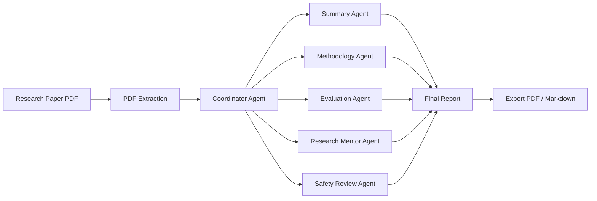
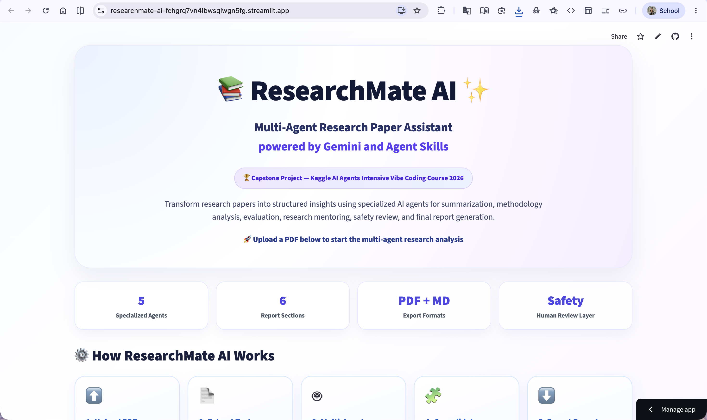
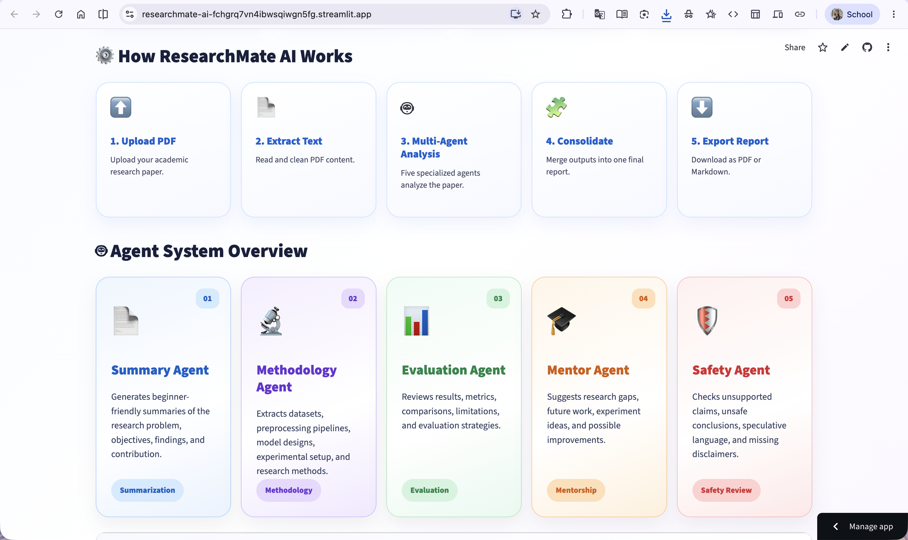
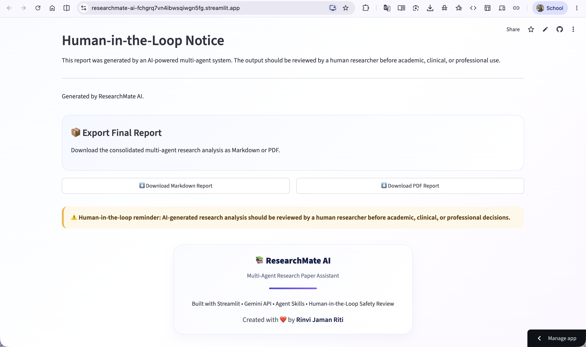

# 📚 ResearchMate AI

### Multi-Agent Research Paper Analysis Platform

ResearchMate AI is a multi-agent research assistant that automatically analyzes academic papers and generates structured insights using specialized AI agents.

Researchers, students, and academics can upload a PDF research paper and receive a comprehensive report covering paper summarization, methodology analysis, evaluation of results, research recommendations, and safety assessment.

Built as a capstone project for the **Google × Kaggle AI Agents Intensive: Vibe Coding Course 2026**.

---

## 🚀 Features

* 📄 Upload and analyze academic research papers in PDF format
* 🤖 Multi-agent architecture with specialized AI agents
* 🔬 Automated methodology and experimental workflow extraction
* 📊 Results, metrics, and limitation analysis
* 🎓 Research mentorship and future work recommendations
* 🛡️ Safety and reliability assessment of research claims
* 📑 Export consolidated reports in Markdown and PDF formats

---

## 🧠 Multi-Agent Workflow



---

## 🤖 Agent Architecture

| Agent                    | Responsibility                                                                           |
| ------------------------ | ---------------------------------------------------------------------------------------- |
| 📄 Summary Agent         | Generates concise summaries of research objectives, methods, findings, and contributions |
| 🔬 Methodology Agent     | Extracts datasets, preprocessing steps, model architectures, and experimental workflows  |
| 📊 Evaluation Agent      | Reviews performance metrics, limitations, comparisons, and overall effectiveness         |
| 🎓 Research Mentor Agent | Suggests future research directions, improvements, and project ideas                     |
| 🛡️ Safety Review Agent  | Identifies unsupported claims, risks, missing disclaimers, and reliability concerns      |

---

## 📸 Screenshots

### Dashboard

Main interface for uploading research papers and launching multi-agent analysis.



### Agent System Overview

Visualization of the specialized AI agents that collaboratively analyze uploaded papers.



### Final Report Export

Download consolidated analysis reports in Markdown or PDF format.



---

## 🛠️ Technology Stack

| Component               | Technology        |
| ----------------------- | ----------------- |
| Frontend                | Streamlit         |
| Backend                 | Python            |
| AI Model                | Google Gemini API |
| PDF Processing          | PyPDF2            |
| Version Control         | Git & GitHub      |
| Development Environment | VS Code           |

---

## 📂 Project Structure

```text
ResearchMate-AI/
│
├── agents/
│   ├── summary_agent.py
│   ├── methodology_agent.py
│   ├── evaluation_agent.py
│   ├── research_mentor_agent.py
│   └── safety_agent.py
│
├── skills/
├── utils/
├── Screenshots/
│
├── app.py
├── requirements.txt
├── .env.example
└── README.md
```

---

## ⚙️ Installation

### Clone Repository

```bash
git clone https://github.com/rinviriti/ResearchMate-AI.git
cd ResearchMate-AI
```

### Install Dependencies

```bash
pip install -r requirements.txt
```

### Configure Environment Variables

Create a `.env` file:

```env
GEMINI_API_KEY=YOUR_API_KEY
```

### Launch Application

```bash
streamlit run app.py
```

---

## 🎯 Skills Demonstrated

* Multi-Agent Systems
* Agent-Oriented Design
* Prompt Engineering
* Human-in-the-Loop AI
* AI Safety Evaluation
* Research Automation
* Streamlit Application Development
* Research Workflow Engineering

---

## 🔮 Future Enhancements

* MCP Server Integration
* Google ADK Agent Orchestration
* Citation Verification Agent
* ArXiv and PubMed Search Integration
* Research Gap Detection Agent
* Paper-to-Presentation Generator
* Automated Literature Review Builder
* Multi-Paper Comparative Analysis

---

## 👩‍💻 Author

**Rinvi Jaman Riti**
B.Sc. in Computer Science & Engineering
Daffodil International University

GitHub: https://github.com/rinviriti

---

## 📜 License

This project is released under the MIT License.
