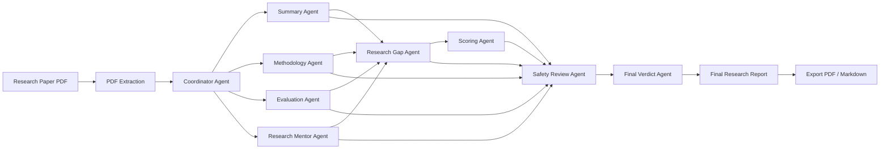

# 📚 ResearchMate AI

### Multi-Agent Research Paper Analysis Platform

ResearchMate AI is a multi-agent research assistant that analyzes academic papers and generates structured research insights using specialized AI agents.

Users can upload a PDF research paper and receive a comprehensive report covering paper context, summarization, methodology analysis, evaluation review, research gap detection, research recommendations, scoring, safety review, and a final verdict.

Built as a capstone project for the **Google × Kaggle AI Agents Intensive: Vibe Coding Course 2026**.

---

## 🔗 Live Demo

[Open ResearchMate AI](https://researchmate-ai-fchgrq7vn4ibwsqiwgn5fg.streamlit.app/)

---

## 🚀 Features

* 📄 Upload and analyze academic research papers in PDF format
* 🧭 Coordinator Agent for paper context and analysis planning
* 🤖 Multi-agent architecture with specialized research agents
* 🔬 Automated methodology and experimental workflow extraction
* 📊 Results, metrics, baseline, and limitation analysis
* 🔎 Research gap detection
* 🎓 Research mentorship and future work recommendations
* ⭐ Research quality scoring
* 🛡️ Safety and reliability assessment of AI-generated claims
* 📑 Export consolidated reports in Markdown and PDF formats

---

## 🧠 Multi-Agent Workflow



---

## 🤖 Agent Architecture

| Agent                    | Responsibility                                                                                   |
| ------------------------ | ------------------------------------------------------------------------------------------------ |
| 🧭 Coordinator Agent     | Identifies paper type, domain, methods, datasets, evaluation focus, and risk flags               |
| 📄 Summary Agent         | Generates concise summaries of research objectives, methods, findings, and contributions         |
| 🔬 Methodology Agent     | Extracts datasets, preprocessing steps, model architectures, and experimental workflows          |
| 📊 Evaluation Agent      | Reviews metrics, baseline methods, results, limitations, and comparative performance             |
| 🔎 Research Gap Agent    | Detects explicit and hidden research gaps, dataset gaps, methodology gaps, and deployment gaps   |
| 🎓 Research Mentor Agent | Suggests future research directions, experiment ideas, and practical improvements                |
| ⭐ Scoring Agent          | Produces research quality scores with reasoning and justification                                |
| 🛡️ Safety Review Agent  | Identifies unsupported claims, risk-prone wording, missing disclaimers, and reliability concerns |
| 🏁 Final Verdict Agent   | Synthesizes all agent outputs into a final professional recommendation                           |

---

## 📸 Screenshots

### Dashboard

Main interface for uploading research papers and launching multi-agent analysis.


### Agent System Overview

Visualization of the specialized AI agents that collaboratively analyze uploaded papers.


### Final Report Export

Download consolidated analysis reports in Markdown or PDF format.


---

## 🛠️ Technology Stack

| Component               | Technology        |
| ----------------------- | ----------------- |
| Frontend                | Streamlit         |
| Backend                 | Python            |
| AI Model                | Google Gemini API |
| PDF Processing          | PyPDF2            |
| Report Export           | ReportLab         |
| Version Control         | Git & GitHub      |
| Development Environment | VS Code           |

---

## 📂 Project Structure

```text
ResearchMate-AI/
│
├── agents/
│   ├── coordinator_agent.py
│   ├── summary_agent.py
│   ├── methodology_agent.py
│   ├── evaluation_agent.py
│   ├── research_gap_agent.py
│   ├── research_mentor_agent.py
│   ├── scoring_agent.py
│   ├── safety_agent.py
│   ├── final_verdict_agent.py
│   └── llm_utils.py
│
├── skills/
├── utils/
├── Screenshots/
│
├── app.py
├── requirements.txt
├── .env.example
└── README.md
```

---

## ⚙️ Installation

### Clone Repository

```bash
git clone https://github.com/rinviriti/ResearchMate-AI.git
cd ResearchMate-AI
```

### Install Dependencies

```bash
pip install -r requirements.txt
```

### Configure Environment Variables

Create a `.env` file:

```env
GEMINI_API_KEY=YOUR_API_KEY
GEMINI_MODEL=gemini-2.5-flash
```

### Launch Application

```bash
streamlit run app.py
```

---

## 🎯 Skills Demonstrated

* Multi-Agent Systems
* Agent-Oriented Design
* Prompt Engineering
* Agent Skills
* Research Workflow Automation
* Human-in-the-Loop AI
* AI Safety Evaluation
* Streamlit Application Development
* PDF Processing and Report Generation

---

## 🔮 Future Enhancements

* MCP Server Integration
* Google ADK Agent Orchestration
* Citation Verification Agent
* ArXiv and PubMed Search Integration
* Paper-to-Presentation Generator
* Automated Literature Review Builder
* Multi-Paper Comparative Analysis

---

## 👩‍💻 Author

**Rinvi Jaman Riti**
B.Sc. in Computer Science & Engineering
Daffodil International University

GitHub: https://github.com/rinviriti

---

## 📜 License

This project is released under the MIT License.
