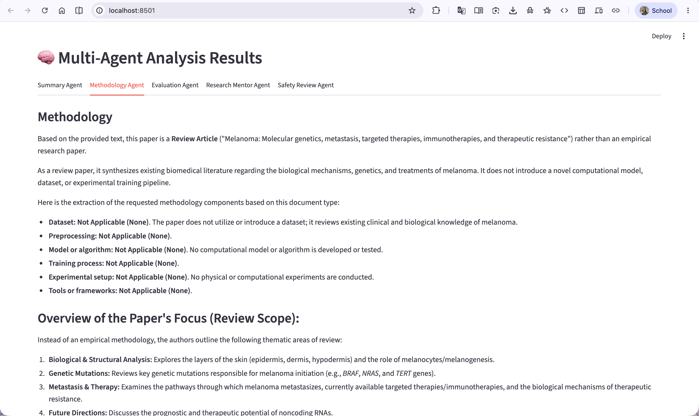
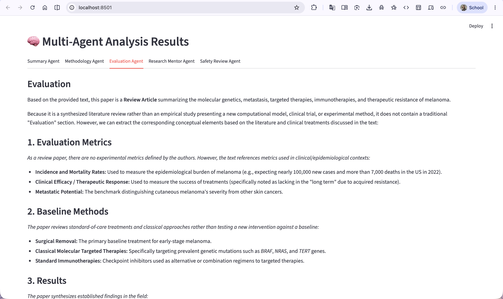
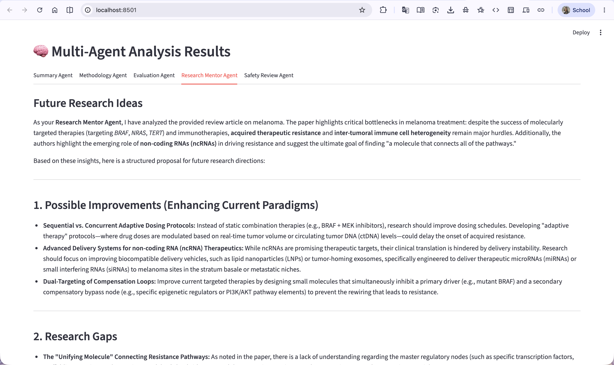
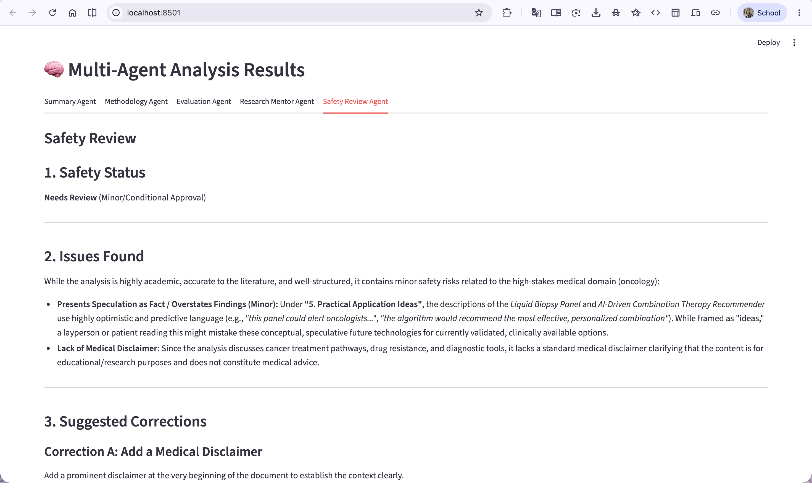

# 📚 ResearchMate AI

## A Multi-Agent Research Paper Assistant

ResearchMate AI is an intelligent multi-agent system designed to help students, researchers, and academics analyze scientific research papers automatically.

The platform extracts text from uploaded PDF papers and coordinates multiple specialized AI agents to generate comprehensive insights including summaries, methodology explanations, evaluation reports, future research directions, and safety reviews.

Built as a capstone project for the **Google × Kaggle 5-Day AI Agents: Intensive Vibe Coding Course 2026**.

---

## 🚀 Features

### 📄 PDF Research Paper Analysis

* Upload any academic research paper in PDF format
* Automatic text extraction
* Support for large research documents

### 🤖 Multi-Agent Architecture

ResearchMate AI uses five specialized AI agents:

| Agent                 | Responsibility                                             |
| --------------------- | ---------------------------------------------------------- |
| Summary Agent         | Generates beginner-friendly summaries                      |
| Methodology Agent     | Explains research methods and workflows                    |
| Evaluation Agent      | Reviews strengths, weaknesses, and limitations             |
| Research Mentor Agent | Suggests future research directions and project ideas      |
| Safety Review Agent   | Detects risks, speculative claims, and missing disclaimers |

---

## 🧠 Agent Workflow

User
  │
  ▼
PDF Upload
  │
  ▼
PDF Extraction Tool
  │
  ▼
Coordinator Agent
  │
  ├── Summary Agent
  │     └── Generates beginner-friendly paper summary
  │
  ├── Methodology Agent
  │     └── Extracts dataset, model, preprocessing, and methods
  │
  ├── Evaluation Agent
  │     └── Reviews metrics, results, limitations, and comparisons
  │
  ├── Research Mentor Agent
  │     └── Suggests research gaps, future work, and improvements
  │
  └── Safety Review Agent
        └── Checks unsupported claims, risks, and missing disclaimers
  │
  ▼
Final Research Report
---

## 🛡️ Safety & Human-in-the-Loop Review

ResearchMate AI includes a dedicated Safety Review Agent that evaluates generated content for:

* Medical misinformation risks
* Overstated conclusions
* Unsupported claims
* Missing disclaimers
* Hallucination-prone recommendations

This provides a human-in-the-loop review layer for high-stakes domains such as healthcare and biomedical research.

---

## 📸 Screenshots

### 🏠 Dashboard

The main interface where users upload research papers in PDF format and launch the multi-agent analysis workflow. The system automatically extracts text and prepares it for agent-based processing.


---

### 📄 Summary Agent

Generates a beginner-friendly summary of the research paper, explaining the problem statement, objectives, key findings, and practical applications in an easy-to-understand format.


---

### 🔬 Methodology Agent

Analyzes the research methodology and identifies datasets, preprocessing techniques, model architectures, training strategies, and evaluation procedures used in the study.



---

### 📊 Evaluation Agent

Reviews experimental results and performance metrics, highlighting strengths, weaknesses, comparisons with baseline methods, and overall research effectiveness.



---

### 🎓 Research Mentor Agent

Acts as an academic mentor by providing future research directions, thesis ideas, improvement suggestions, publication opportunities, and potential extensions of the work.



---

### 🛡️ Safety Review Agent

Performs safety and trustworthiness checks on AI-generated content. The agent identifies potential risks, missing disclaimers, overconfident claims, and areas requiring human review before deployment.



---

## 🛠️ Tech Stack

### Frontend

* Streamlit

### Backend

* Python

### AI Model

* Google Gemini API

### PDF Processing

* PyPDF2

### Development Tools

* Git
* GitHub
* VS Code

---

## 📂 Project Structure

```text
ResearchMate-AI/
│
├── agents/
│   ├── summary_agent.py
│   ├── methodology_agent.py
│   ├── evaluation_agent.py
│   ├── research_mentor_agent.py
│   └── safety_agent.py
│
├── skills/
│   ├── summary_skill.md
│   ├── methodology_skill.md
│   ├── evaluation_skill.md
│   ├── research_mentor_skill.md
│   └── safety_skill.md
│
├── utils/
│   └── pdf_reader.py
│
├── app.py
├── requirements.txt
├── .env.example
└── README.md
```

---

## ⚙️ Installation

### Clone Repository

```bash
git clone https://github.com/rinviriti/ResearchMate-AI.git
cd ResearchMate-AI
```

### Install Dependencies

```bash
pip install -r requirements.txt
```

### Configure Environment Variables

Create a `.env` file:

```env
GOOGLE_API_KEY=YOUR_GEMINI_API_KEY
```

### Run Application

```bash
streamlit run app.py
```

---

## 💡 Example Use Cases

* Literature review assistance
* Research paper understanding
* Thesis preparation
* Research gap identification
* Academic project planning
* Scientific paper evaluation
* Medical paper safety review

---

## 🎯 Kaggle AI Agents Capstone Concepts Demonstrated

This project demonstrates multiple concepts from the Google × Kaggle AI Agents Intensive:

✅ Multi-Agent Systems

✅ Agent Skills

✅ Security & Safety Evaluation

✅ Human-in-the-Loop Review

✅ Vibe Coding Workflow

---

## 🔮 Future Improvements

* MCP Server Integration
* ADK Agent Orchestration
* Citation Verification Agent
* ArXiv/PubMed Search Agent
* Research Gap Detection Agent
* Paper-to-Presentation Generator
* Automatic Literature Review Builder
* Multi-PDF Comparative Analysis

---

## 👩‍💻 Author

**Rinvi Jaman Riti**

B.Sc. in Computer Science & Engineering
Daffodil International University

GitHub: https://github.com/rinviriti

---

## 📜 License

This project is released under the MIT License.
